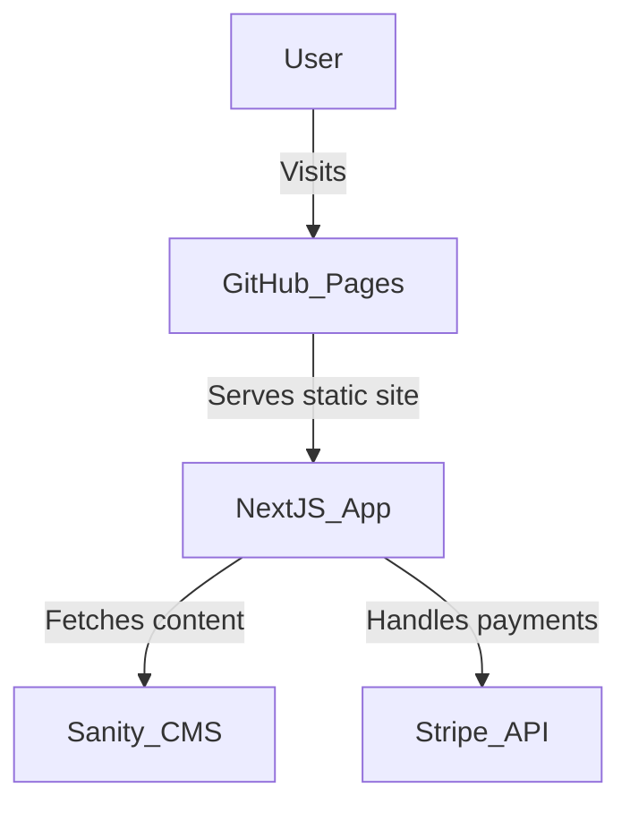

# Hotel Management Platform

A full-stack hotel management and booking platform built with **Next.js 14 (App Router)**, **Sanity CMS**, **Stripe**, and **NextAuth**. This project demonstrates modern web development skills, including dynamic routing, server/client components, authentication, payment integration, and scalable code organization.

---

## 🚀 Features

- **Room Listings & Filtering:**  
  Browse, search, and filter hotel rooms by type and amenities.

- **Dynamic Routing:**  
  Uses Next.js App Router with dynamic segments (e.g., `/rooms/[slug]`, `/users/[id]`).

- **Room Details & Booking:**  
  View detailed room info, amenities, photo galleries, and book rooms with date selection.

- **Stripe Payments:**  
  Secure, server-side Stripe Checkout integration for booking payments.

- **Authentication:**  
  Social login via GitHub and Google using NextAuth, with protected routes and user dashboards.

- **Sanity CMS Integration:**  
  All room, amenity, and booking data is managed in Sanity Studio, with custom schemas.

- **User Dashboard:**  
  Users can view their bookings, payment history, and reviews.

- **Responsive UI:**  
  Built with Tailwind CSS and React, supporting light/dark mode.

---

## 🛠️ Tools & Technologies

- **Frontend:**

  - [Next.js 14 (App Router)](https://nextjs.org/docs/app)
  - [React 18+](https://react.dev/)
  - [Tailwind CSS](https://tailwindcss.com/)
  - [SWR](https://swr.vercel.app/) (data fetching & caching)
  - [React Icons](https://react-icons.github.io/react-icons/)

- **Backend/API:**

  - [Next.js API Routes](https://nextjs.org/docs/app/building-your-application/routing/api-routes)
  - [Stripe Node.js SDK](https://stripe.com/docs/api)
  - [NextAuth.js](https://next-auth.js.org/) (authentication)
  - [Sanity CMS](https://www.sanity.io/) (headless CMS)

- **Other:**
  - [Axios](https://axios-http.com/) (HTTP requests)
  - [React Hot Toast](https://react-hot-toast.com/) (notifications)
  - [TypeScript](https://www.typescriptlang.org/)

---

## 📁 Project Structure

```
/src
  /app
    /(web)
      /rooms
        [slug]/page.tsx      # Dynamic room details & booking
        page.tsx             # Room listing & filtering
      /users
        [id]/page.tsx        # User dashboard
    /components              # Reusable UI components
    /api
      /stripe/route.ts       # Stripe payment API endpoint
  /libs
    apis.ts                  # Sanity & booking API helpers
    stripe.ts                # Stripe client loader
    sanity.ts                # Sanity client config
    sanityQueries.ts         # GROQ queries for Sanity
  /models                    # TypeScript models for Room, Booking, User
/schemaTypes                 # Sanity schema definitions
```

---

## 🔒 Authentication & Protected Routes

- Uses NextAuth for GitHub/Google login.
- Middleware (`src/middleware.ts`) protects `/users/*` routes, requiring authentication.

---

## 💳 Stripe Payment Flow

1. User selects room, dates, and guests.
2. Clicks "Book Now" → `handleBookNowClick` sends booking data to `/api/stripe`.
3. API route validates, fetches room, calculates price, and creates Stripe Checkout session.
4. User is redirected to Stripe for secure payment.
5. On success, user is redirected back and booking is saved.

---

## 🗂️ Sanity CMS

- Custom schemas for rooms, amenities, and bookings.
- Amenity icons are managed via a string field (Font Awesome class) in Sanity Studio.
- All content is fully editable in the CMS.

---

## 🌗 Theming

- Tailwind CSS with dark mode support (`dark:` classes).
- Responsive and accessible UI.

---

## 🧑‍💻 Development Skills Demonstrated

- Modern React (hooks, client/server components, SWR)
- TypeScript throughout (type safety, models, props)
- Full-stack Next.js (App Router, API routes, middleware)
- Third-party integrations (Stripe, NextAuth, Sanity)
- Scalable code structure and clean separation of concerns
- Custom Sanity schemas and GROQ queries
- Secure handling of environment variables and secrets

---

## 📝 Getting Started

1. **Clone the repo**
2. **Install dependencies**
   ```sh
   npm install
   ```
3. **Set up your `.env` file** (see example in repo)
4. **Run Sanity Studio** (if editing content)
   ```sh
   cd studio && sanity start
   ```
5. **Run the Next.js app**
   ```sh
   npm run dev
   ```

---

## 📣 Contact

Feel free to reach out if you have questions about the code or want to discuss collaboration!

---


